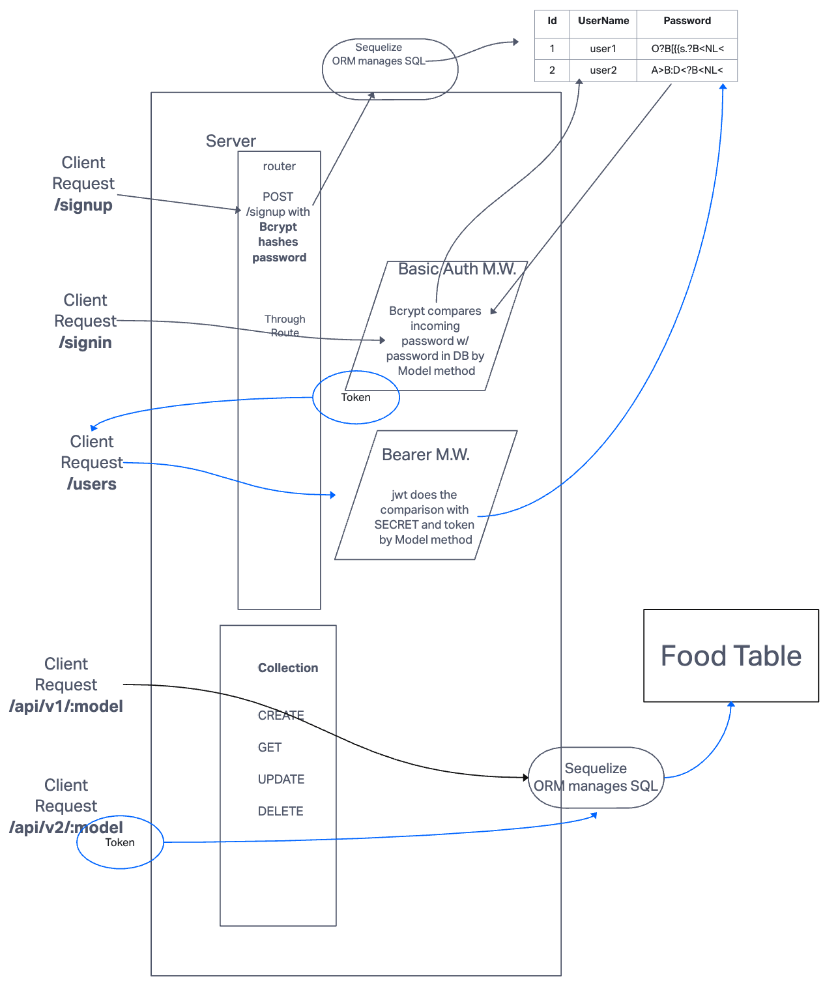

# Access Control

## Project: Bearer Authentication

### Author: Francisco

### Problem Domain

Deploy an Express server that implements Bearer Token Authentication. Once a user has successfully logged in using basic authentication, they should be able to continuously authenticate using the generated token. Extend the restrictive capabilities of our routes to our API, implementing a fully functional, authenticated and authorized API Server for a variety of user types.

### Links and Resources

- [GitHub Actions ci/cd](https://github.com/c0d3cisco/auth-api/actions)
- [Back-end prod server url](https://access-control.onrender.com/)

## Collaborators

Code was written while Ryan Gallaway taught a class for API Server.

### Setup

#### `.env` requirements (where applicable)

Port variable exists within the env sample.

Ensure to have sequelize database URL in the env file.

#### How to initialize/run your application (where applicable)

1. Clone this repository to a location of your choosing. In the terminal, navigate to the directory and run the following commands:
2. `npm i` to install dependencies
3. **Copy** the `.env.sample` file and rename it to `.env`, then **update** the `.env` file with your `PORT` and `DATABASE_URL`
4. Run `db:config` to create the `config.json` file
5. **Update** the "username" in `config.json` with your PostgreSQL username and set the "dialect" to "postgres"
6. Run `db:create` to create the database
7. Run `nodemon` to start the server
8. Use Thunder Client to utilize API functionality with the routes listed below

#### Routes

- `POST /signup` to create a new user. Send a JSON object in the request body with the following properties:
  - `username` - required
  - `password` - required
- `POST /signin` to sign in as a user. Sent an Auth header with a Basic Auth username and password.
- `GET /users` to get a list of all users. Sent an Auth header with a Bearer Token.

 

- `GET /api/v1/food` to get a list of all food items.
- `POST /api/v1/food` to create a new food item.
- `PUT /api/v1/food/:id` to update a food item.
- `DELETE /api/v1/food/:id` to delete a food item.
- `GET /api/v1/clothes` to get a list of all clothes items.
- `POST /api/v1/clothes` to create a new clothes item.
- `PUT /api/v1/clothes/:id` to update a clothes item.
- `DELETE /api/v1/clothes/:id` to delete a clothes item.

 

- `GET /api/v2/food` to get a list of all food items. Sent an Auth header with a Bearer Token.
- `POST /api/v2/food` to create a new food item. Sent an Auth header with a Bearer Token.
- `PUT /api/v2/food/:id` to update a food item. Sent an Auth header with a Bearer Token.
- `DELETE /api/v2/food/:id` to delete a food item. Sent an Auth header with a Bearer Token.
- `GET /api/v2/clothes` to get a list of all clothes items. Sent an Auth header with a Bearer Token.
- `POST /api/v2/clothes` to create a new clothes item. Sent an Auth header with a Bearer Token.
- `PUT /api/v2/clothes/:id` to update a clothes item. Sent an Auth header with a Bearer Token.
- `DELETE /api/v2/clothes/:id` to delete a clothes item. Sent an Auth header with a Bearer Token.

#### Tests

run the command `npm test`

#### UML

